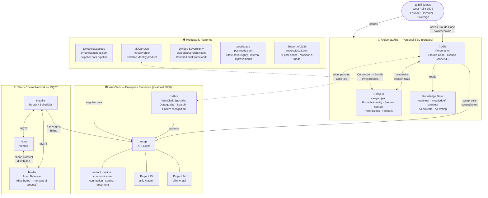
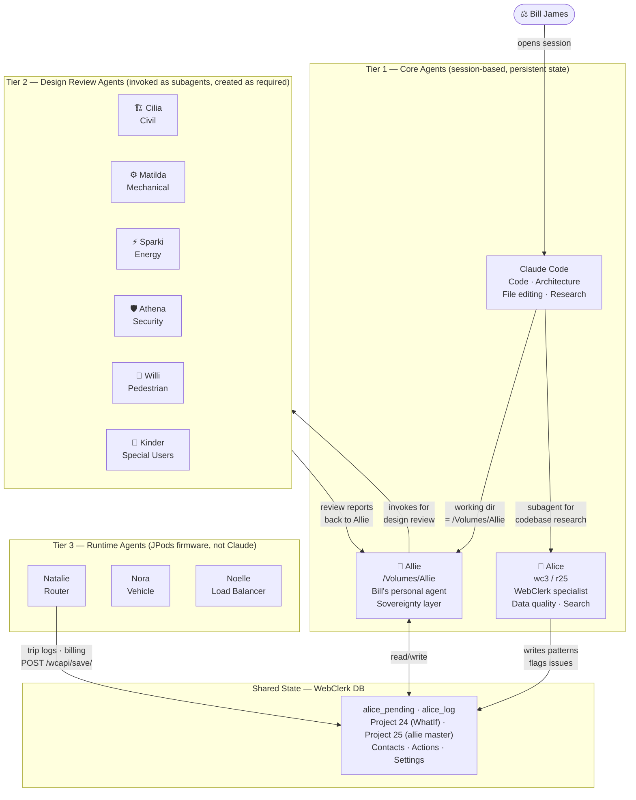
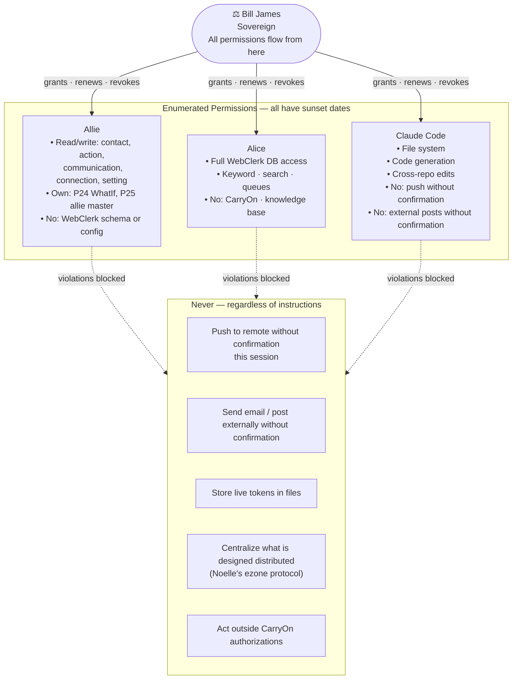
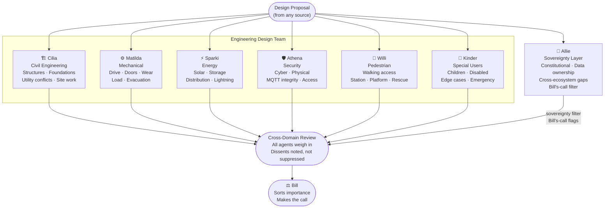

# System Map — Bill James Ecosystem
**Last Updated:** 2026-04-04
**Purpose:** Visual reference for the full system of software, agents, and data flows

Render in VS Code (Mermaid preview) or GitHub. Source text is readable without rendering.

---

## 1. The Ecosystem — Everything and How It Connects

The central principle: **the individual is sovereign; institutions are agents with enumerated, revocable permissions.** Every project below is an application of that principle in a different domain.



---

## 2. The Agent Layer — Who Does What

One intelligence layer (Claude), three tiers of agents, one database (WebClerk), no central controller.

**Tier 1 — Core agents:** Always available. Session-based. Own persistent state.
**Tier 2 — Design review agents:** Invoked as subagents when a proposal needs review. Created on demand from agent spec files. Not persistent.
**Tier 3 — Runtime agents:** Embedded firmware on the JPods network. Not Claude. Not session-based.



### Agent Roster

| Agent | Tier | Spec file | Invoked by | Owns |
|-------|------|-----------|-----------|------|
| Claude Code | 1 | *(is the intelligence layer)* | Bill | Code, architecture, file editing, cross-repo work |
| Allie | 1 | `readmes/agents/Allie.agent.md` | Bill (opens /Volumes/Allie) | CarryOn, knowledge base, WhatIf store, sovereignty layer, cross-domain synthesis |
| Alice | 1 | `webClerk3/.github/agents/Alice.agent.md` | Claude Code (subagent) | Keyword index, search presets, alice_pending lifecycle, search quality |
| Cilia | 2 | `readmes/agents/Cilia.agent.md` | Allie (subagent, on demand) | Civil engineering review: structures, foundations, utilities, site conflicts |
| Matilda | 2 | `readmes/agents/Matilda.agent.md` | Allie (subagent, on demand) | Mechanical review: drive, doors, wear, load, evacuation |
| Sparki | 2 | `readmes/agents/Sparki.agent.md` | Allie (subagent, on demand) | Energy review: solar, storage, distribution, lightning, grid |
| Athena | 2 | `readmes/agents/Athena.agent.md` | Allie (subagent, on demand) | Security review: cyber, physical, MQTT integrity, access control |
| Willi | 2 | `readmes/agents/Willi.agent.md` | Allie (subagent, on demand) | Pedestrian review: walking access, station, platform, rescue paths |
| Kinder | 2 | `readmes/agents/Kinder.agent.md` | Allie (subagent, on demand) | Special user review: children, disabled, edge cases, emergency egress |
| Natalie | 3 | *(firmware — JPods MQTT)* | Hardware boot | Trip routing, scheduling, booking, billing |
| Nora | 3 | *(firmware — JPods MQTT)* | Hardware boot | Vehicle sensing, movement, telemetry |
| Noelle | 3 | *(firmware — JPods MQTT)* | Hardware boot | Load balancing, ezone protocol, prepositioning |

### Calibration Feedback Loop — Nora → Matilda

Nora reports her self-measured `mmStep` to Matilda after every line completion. This is the only place in the system where a Tier 2 design agent (Matilda) receives live data from a Tier 3 runtime agent (Nora).

```
Nora completes a guideway line
  → calibration.py computes measured mmStep (damped, guarded)
  → updates mmStepCalibrated for live odometry
  → MQTT CALIBRATION → SERVER + MATILDA topics
    → Scale model: podPresenter/Matilda.pde — live fleet panel on screen
    → Production:  matilda/matilda.py — fleet_log.json on Matilda's machine
      → Individual pod drift >5% = wheel wear flag
      → Collective line bias >3% = map length error flag
```

Source: `jpod_OS/calibration.py`, `podPresenter/Matilda.pde`, `matilda/matilda.py`

---

### Creating a Tier 2 Agent

Tier 2 agents do not exist until they are needed. When a design review is required:

1. The agent spec file (`readmes/agents/<Name>.agent.md`) defines the agent's domain, standing to challenge, review protocol, and which files to read at startup.
2. Allie invokes the agent as a subagent, passing the proposal and the spec.
3. The agent returns a single review report with findings and any cross-domain flags.
4. Allie synthesizes all reports, notes dissents, and routes to Bill's-call filter before presenting.

**Agent spec files to create** (none exist yet — create before first design review):
- `readmes/agents/Cilia.agent.md`
- `readmes/agents/Matilda.agent.md`
- `readmes/agents/Sparki.agent.md`
- `readmes/agents/Athena.agent.md`
- `readmes/agents/Willi.agent.md`
- `readmes/agents/Kinder.agent.md`
- `readmes/agents/Allie.agent.md` *(sovereignty layer spec — separate from Allie's general persona)*

---

## 3. Data Sovereignty — Where Data Lives and Why

The rule: **sovereign data stays local; collaborative data lives in WebClerk.**

```mermaid
flowchart LR
    subgraph LOCAL["💾  Local — /Volumes/Allie\n(sovereign · portable · offline-capable)"]
        direction TB
        MED["Medical info\n_sensitivity: high"]
        CREDS["Credentials\npointers only\nnot the secrets"]
        SES["Session context\nopen threads\ncurrent work"]
        PREFS["Local preferences\noffline queue"]
        KB2["Knowledge base\nreadmes · writing\nresearch · code"]
    end

    subgraph WC2["🏛️  WebClerk\n(collaborative · persistent · enterprise)"]
        direction TB
        CONTACTS["Contacts"]
        ACTIONS["Actions / Tasks"]
        EMAIL["Communications\nEmail threads"]
        CAL["Connections\nCalendar events"]
        SETTINGS["Settings\nPattern features"]
        DOCS["Documents\nFile pointers"]
    end

    subgraph BRIDGE["CarryOn — The Bridge\ncarryon.json"]
        PTR["Pointers to WebClerk records\nwebclerk_contact_id\nwebclerk_base_url\nNOT the data itself"]
    end

    LOCAL --- BRIDGE
    BRIDGE -->|"fetch when needed\nGET /wcapi/get/"| WC2
    BRIDGE -->|"write with confirmation\nPOST /wcapi/save/"| WC2

    OFFLINE["When offline:\nAllie works from\nCarryOn + local KB\nQueues writes for\nnext online session"]
    BRIDGE -.-> OFFLINE
```



---

## 4. JPods Control — Distributed Network (No Central Controller)

Patent US 6,810,817. Three behavioral roles; every device on the network can manifest any role.

A JPods deployment is a **federation of Local Area Networks**. Each LAN is a physically bounded guideway section with its own MQTT broker, its own pod fleet, and its own Natalie. Natalies negotiate peer-to-peer at LAN boundaries — no central dispatcher above them.

**Today:** one LAN (scale model). **Tomorrow:** many LANs, boundary negotiation between Natalies.

```mermaid
flowchart TB
    subgraph LAN_A["LAN A — e.g. Campus Loop\n(and every future LAN follows this same pattern)"]
        direction TB

        subgraph NATALIE_BOX["Natalie — Router / Scheduler\nClaims 8, 9, 11, 12, 13\nRuns on Mac · podPresenter · today: one Natalie per deployment"]
            direction LR
            REQ["Receive\ntrip request"]
            NEG["Negotiate\navailability"]
            SCHED["Assign route\nmyPath"]
            BOOK["Book capacity\nin each device"]
            LOG["Log · Bill"]
            REQ --> NEG --> SCHED --> BOOK --> LOG
        end

        subgraph NORA_BOX["Nora — Vehicle\nClaims 1, 6, 7, 12a, 17"]
            direction LR
            SENSE["Sense position\nHuskyLens / ToF"]
            MOVE["Motor · Servo\nI2C control"]
            TELEM["Broadcast\ntelemetry via MQTT"]
            SENSE --> MOVE --> TELEM
        end

        subgraph NOELLE_BOX["Noelle — Load Balancer\nClaims 3, 4, 5, 11e, 14g, 18, 20\n⚠️ Distributed — no central process"]
            direction LR
            EZONE["Ezone protocol\none pod per switch\ndistributed consensus"]
            ACCUM["Accumulate\ndevice availability"]
            PREPOS["Preposition\nvehicles to\nanticipated demand"]
            EZONE --- ACCUM --- PREPOS
        end

        MQTT_BUS(["MQTT Bus — one per LAN\nAll state is distributed"])

        NATALIE_BOX <-->|"START · ACTION\nRESEND"| MQTT_BUS
        NORA_BOX <-->|"telemetry\nezone events"| MQTT_BUS
        NOELLE_BOX <-->|"ezone state\navailability"| MQTT_BUS
    end

    subgraph LAN_B["LAN B — e.g. Hub Station\n(future — same structure)"]
        NATALIE_B["Natalie B\nRouter"]
        MQTT_B(["MQTT Bus B"])
        NATALIE_B <--> MQTT_B
    end

    BOUNDARY(["Boundary Point\nphysical junction\nbetween LANs"])

    NATALIE_BOX <-->|"peer negotiation\ntrip handoff\nno dispatcher above"| BOUNDARY
    NATALIE_B <-->|"peer negotiation"| BOUNDARY

    PEC["PEC Formula\nvehicle mass efficiency\nPEC = (vehicle+payload)² / payload²\nCar: 676 · JPod target: <10"]
    NATALIE_BOX -.->|"trip logs · billing\nPOST /wcapi/save/"| WCAPI3["WebClerk\nwcapi"]
    NORA_BOX -.-> PEC

    ALLIE_NET["🤖 Allie\nMac discovery layer\nupdate_pod_ips.sh → podIP.json\ntells Natalie who is on the network\nbefore every launch"]
    ALLIE_NET -->|"MAC discovery\nnetwork handoff"| NATALIE_BOX
```



---

## 5. The Permission Structure — Sovereignty in Practice

Every agent, every permission, has a sunset. No permanent grants.



---

## 6. Engineering Design Team — Cross-Domain Review

Six specialty agents review every JPods design proposal from their own lens. **No agent is siloed.** Each has standing to challenge any other agent's domain when it touches theirs. Disagreements are surfaced — not suppressed — and sorted by importance before going to Bill.

These agents are **design reviewers**, not runtime controllers. Nora, Natalie, and Noelle handle runtime. This team reviews before anything is built or committed.



### Anti-Stovepipe Protocol

Each agent reviews every major proposal from their lens — not just their own deliverables. The rule: **if it touches your domain even slightly, say so.**

| Agent | Primary domain | Standing to challenge |
|-------|---------------|----------------------|
| Cilia | Structures, civil, utilities | Any proposal that loads a foundation, moves earth, or touches existing utilities |
| Matilda | Mechanical systems | Any proposal affecting drive, braking, door, or load-bearing mechanical component |
| Sparki | Energy | Any proposal that adds load, changes panel placement, or creates a lightning/discharge path |
| Athena | Security | Any proposal that opens a network port, creates physical access, or changes MQTT topology |
| Willi | Pedestrian access | Any proposal affecting station placement, platform geometry, rescue path, or pedestrian flow |
| Kinder | Special users | Any proposal affecting pod interior, unaccompanied access, emergency egress, or alert design |
| **Allie** | **Sovereignty layer** | **Any proposal that decides who holds authority, who bears liability, or who controls data — and any risk that lives in the gap between engineering domains** |

When agents disagree:
1. Both positions are recorded in the design record.
2. The disagreement is labeled with the specific dimension of conflict (safety, cost, code compliance, user need, long-term risk).
3. Bill sorts importance — not the agents. Agents advocate; Bill decides.

---

## 7. Ouch List — Risk Register

All risks we can see, no matter how long-tail, that we cannot address now but that could bite us later. See full register: `readmes/system/ouch-list.md`

The rule: **nothing is too small to list.** A risk on the Ouch List is not a blocker — it is a flag. Flags are better than surprises.

The list has two layers:
- **Engineering risks** — owned by Cilia, Matilda, Sparki, Athena, Willi, or Kinder (technical hazards that the design team can work on independently)
- **Sovereignty-layer risks** — owned by Allie (constitutional, data ownership, and cross-ecosystem gaps that require Bill's active judgment before they can move)

### Bill's Call — Five Decisions That Cannot Be Deferred

These five risks cannot be moved to "watching" or "deferred" without an active judgment from Bill. Engineering cannot resolve them; they require a prior decision about authority, liability, or sovereignty architecture.

| Risk | The decision |
|------|-------------|
| X-02 Common carrier status | Which constitutional box does JPods live in? Common carrier imports federal jurisdiction. Private improvement on state ROW preserves the postRoads argument but changes the liability structure. Every deployment contract turns on this. |
| X-07 Federal jurisdiction | Does JPods ever seek federal funding, recognition, or clearance — or proceed entirely on state authority? Agencies do not need to win in court; they can require permits and deny them. |
| A-06 Trip data ownership | Does the passenger own their trip record, or does the operator? Athena cannot design meaningful protection until this is decided. The CarryOn model says the passenger owns it. |
| E-08 Solar energy ownership | Does JPods negotiate energy rights in every ROW agreement (sovereign but complex), or operate grid-connected with solar as cost reduction (simpler but contradicts the 5X5 Standard)? |
| X-08 First deployment site | Not just narrative risk — also constitutional precedent risk. A deployment at a federally funded airport or university may concede the postRoads argument that protects all subsequent state-level deployments. |

---

## Index

| File | What it covers |
|------|---------------|
| `00-system-map.md` (this file) | Full ecosystem · Agent layer · Data sovereignty · JPods control · Permissions · Design team · Risk register |
| `ouch-list.md` | All identified risks, long-tail included, sorted by domain |

*Supporting readmes:*
- `readmes/19-agent-coordination.md` — agent protocol in full detail
- `readmes/05-webclerk-integration.md` — wcapi patterns and sovereignty rule
- `readmes/22-jpods-control-system.md` — Nora/Natalie/Noelle control system
- `readmes/20-data-structure.md` — Project → Action → Document
- `readmes/09-carryon.md` — CarryOn schema and pointer fields
- `knowledge/projects/jpods-patent-6810817.md` — full patent claim analysis

*Agent spec files (Tier 2 — to be created):*
- `readmes/agents/Cilia.agent.md`
- `readmes/agents/Matilda.agent.md`
- `readmes/agents/Sparki.agent.md`
- `readmes/agents/Athena.agent.md`
- `readmes/agents/Willi.agent.md`
- `readmes/agents/Kinder.agent.md`
- `readmes/agents/Allie.agent.md` *(sovereignty layer spec)*
