# JPods SketchUp Plugin — User Workflows

Comprehensive flowchart documentation for the su_jpods plugin.
Covers program architecture, the 8-step student workflow, station template
authoring, connection editing, animation, and JPods Travel.

All Mermaid diagrams render in VS Code (Markdown Preview Enhanced) and GitHub.

---

## 1. Program Architecture Overview

### Scope Boundary: Model vs Network

The plugin has two distinct scopes. Confusing them is the most repeated error
in the codebase.

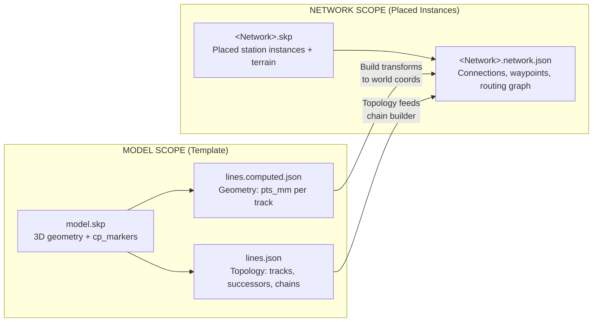

**Key rule:** Compute writes to MODEL scope only. Build writes to NETWORK scope
only. Never cross the boundary.

### Pipeline: Compute → Build → Animate

The three operations are a strict ordered pipeline. Skipping or reversing
produces silent errors.

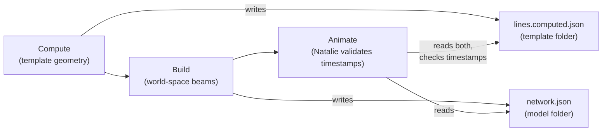

If Compute is newer than Build, Natalie refuses to animate:
*"Run Build before animating."* This is intentional — it prevents silent
degradation from stale geometry.

### Major Components

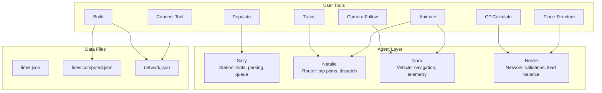

---

## 2. Building a Network — The 8-Step Student Workflow

### Overview

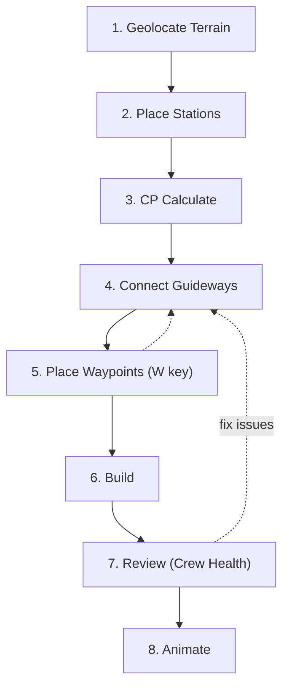

Steps 4 and 5 are interleaved — press W during Connect to drop waypoints.
Review may loop back to step 4 if Noelle finds faults.

### Step 1: Geolocate Terrain

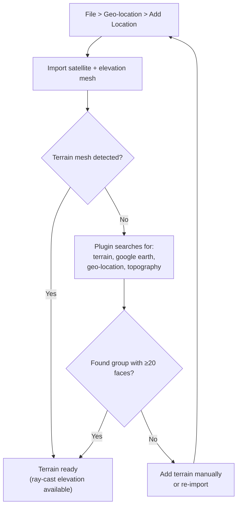

The plugin uses `Terrain.elevation_at(model, x, y)` to ray-cast from 2000m
above each point down to the terrain surface. Without terrain, all guideways
build flat.

### Step 2: Place Stations

**Menu:** Extensions > JPods > Place Structure
**Toolbar:** Place Structure button

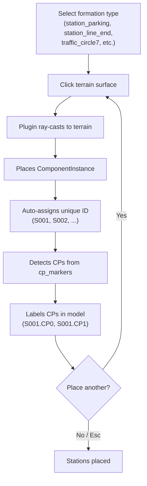

Station IDs are auto-incremented and never recycled, even if a station is
deleted. Each station stores its CP data in local coordinates on the
component instance.

### Step 3: CP Calculate

**Toolbar:** CP Calculate button (toggle)

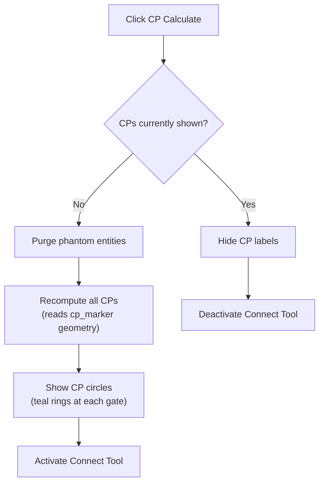

CP Calculate both shows the connection points AND activates the Connect Tool
so the student can immediately start connecting.

### Steps 4-5: Connect Guideways + Waypoints

**Tool:** Activated by CP Calculate
**W key:** Drop waypoint marker at cursor position

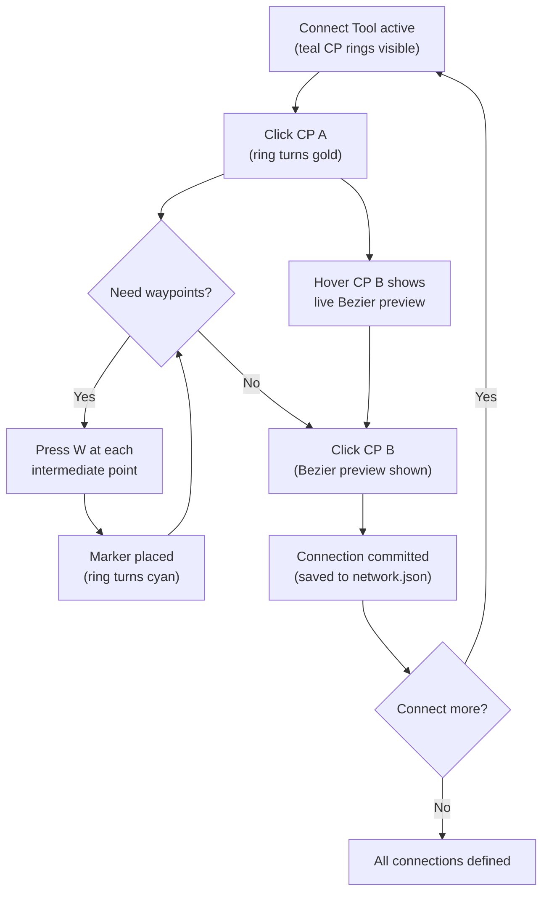

**Visual states during connection:**

| Ring Color | Meaning |
|-----------|---------|
| Teal | CP available, not selected |
| Gold | FROM selected, waiting for TO |
| Yellow | Hovered CP (preview shown) |
| Cyan | Editing waypoints on existing connection |
| White | Inspecting an existing connection |

**Keyboard shortcuts in Connect Tool:**

| Key | Action |
|-----|--------|
| W | Drop waypoint marker at cursor |
| Esc | Cancel selection, or exit tool |
| Shift+click | Delete connection at clicked CP |

Each connection creates a bidirectional pair automatically: `seg_A_B` (forward)
and `seg_B_A` (return). Both are one-way. The Build pipeline generates
separate beam geometry for each direction.

### Step 6: Build

**Console:** Build Network button
**Also:** Extensions > JPods menu

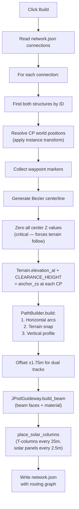

**Key constants that govern Build:**

| Constant | Value | Effect |
|----------|-------|--------|
| CLEARANCE_HEIGHT | 4.6m | Beam bottom above terrain |
| DUAL_TRACK_SPACING | 3.5m | Center-to-center of dual guideways |
| SUPPORT_SPACING | 25m | Column interval |
| MIN_TURN_RADIUS | 30m | Minimum horizontal curve |
| PROFILE_MAX_GRADE | 8% | Maximum guideway slope |

### Step 7: Review (Crew Health Check)

**Toolbar:** Crew Health button

Each agent checks their domain independently:

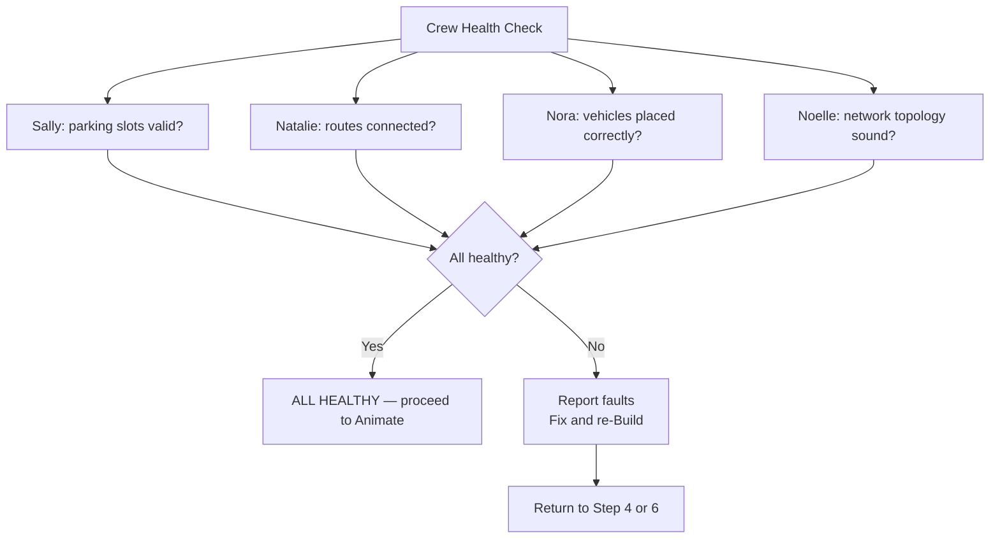

### Step 8: Animate

**Toolbar:** Animate button (toggle: Start / Pause / Resume)

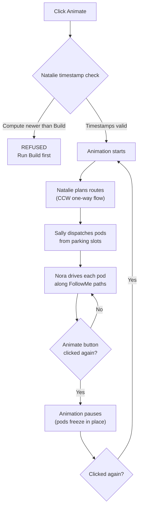

---

## 3. Station Template Authoring

For designers creating or modifying station templates in
`templates/track_formations/<template>/`.

### cp_marker Geometry

Each station has two cp_markers (cp_marker_0 at one end, cp_marker_1 at the
other). Each cp_marker contains four points radiating from a hub:

```
                   centerline (177mm vertical)
                        |
outbound <-- 1750mm -- CP POINT -- 1750mm --> inbound
                        |
                      222mm
                        v
                    vector_end
```

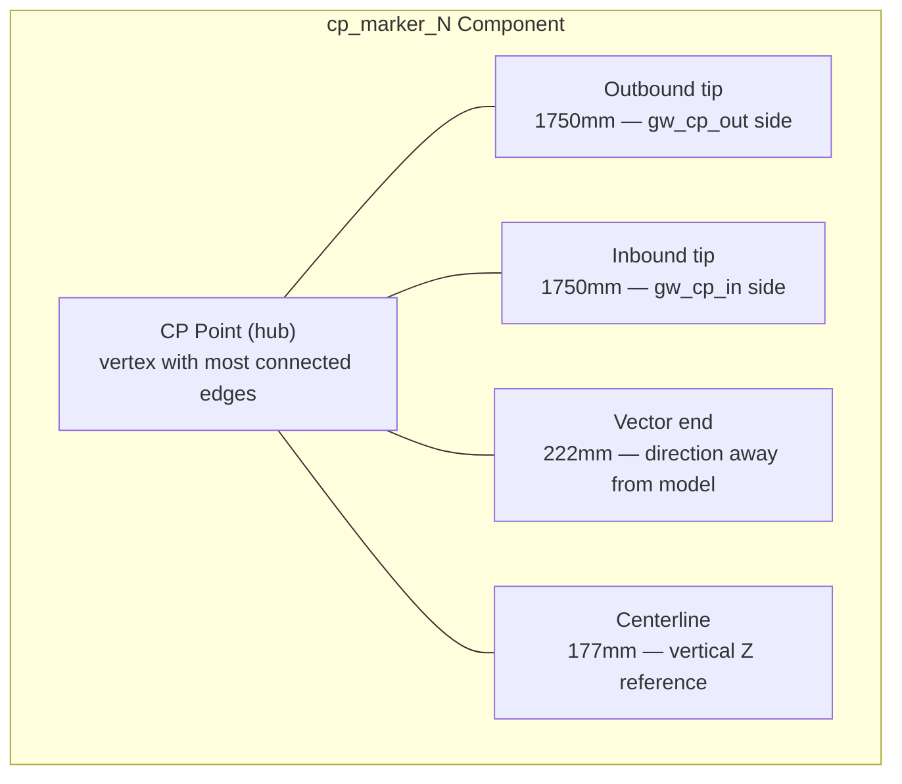

**Reading the cp_marker (pure math, no edges):**
1. Collect all point positions from the component definition
2. CP point = vertex with most connected edges
3. Classify by distance from CP point (222mm / 1750mm / 177mm)
4. Cross product of (222mm direction) x (tip offset) determines
   outbound vs inbound: positive Z = outbound, negative Z = inbound

### lines.json Topology

The designer authors `lines.json` to declare track topology:

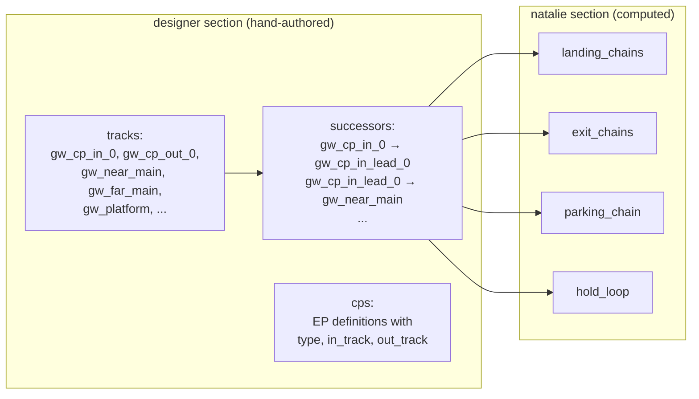

### Compute Pipeline (3 Phases)

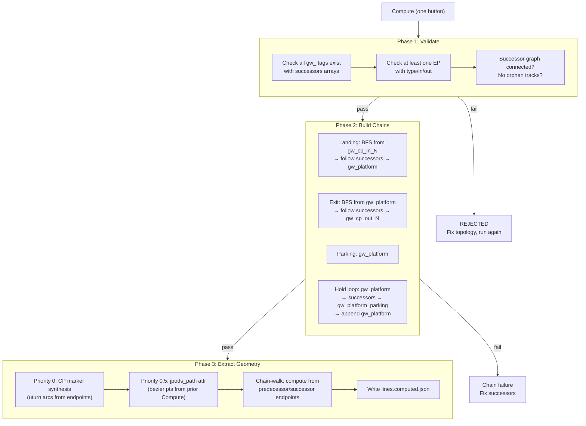

### Station Tests

Run from the JPods Console when a template model is open:

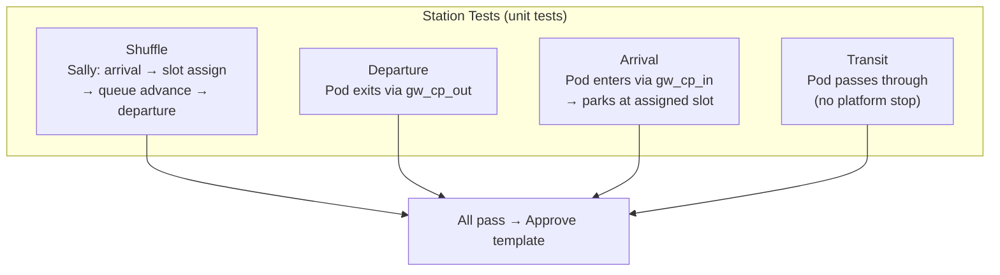

### Approve Workflow

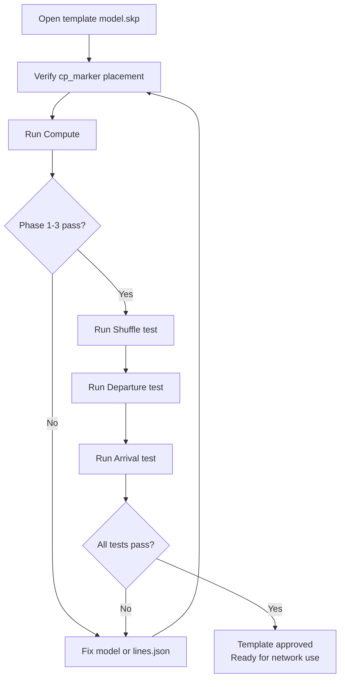

---

## 4. Connection Editing

### Creating a Connection

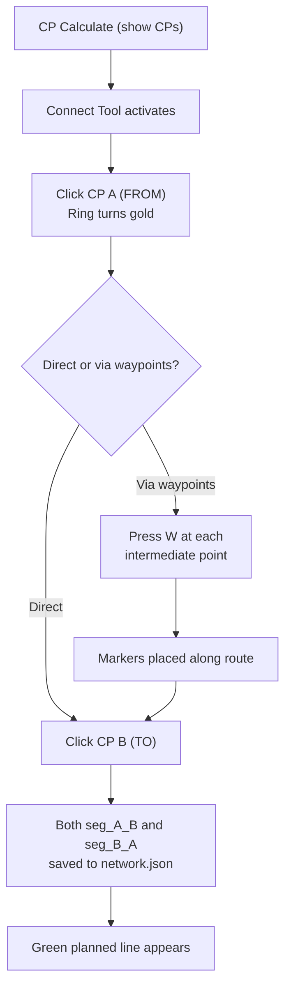

### Deleting a Connection

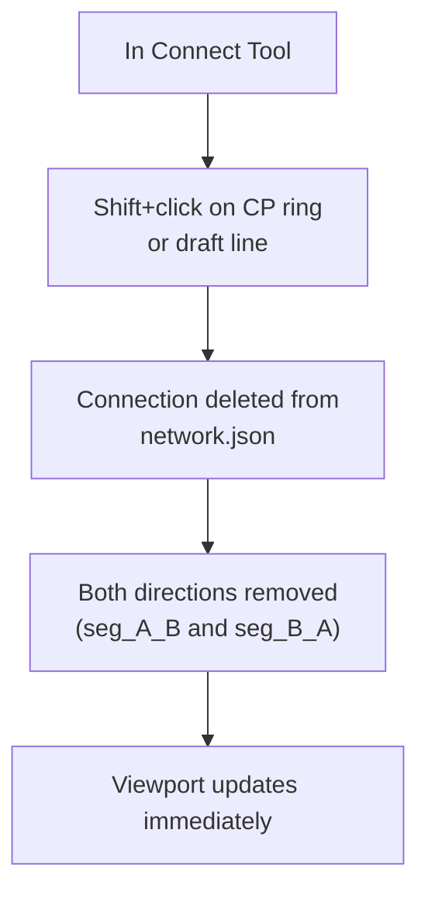

Connections can also be deleted via the Network Display panel in the Console
(x button next to each connection).

### Editing Waypoints on Existing Connection

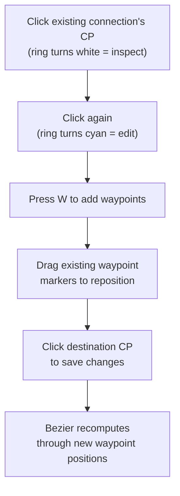

### The Save-Build Cycle

After editing connections:

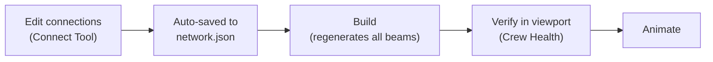

### What network.json Contains

```
network.json
├── station_names        — display names for each station ID
├── connections          — all seg_ connections with from/to/waypoints
│   └── seg_S001.0_S002.1
│       ├── from: { station_id, cp_index }
│       ├── to:   { station_id, cp_index }
│       ├── via_markers: [marker positions]
│       └── tracks: { built geometry per direction }
├── natalie              — routing graph (computed by Build)
└── built_at             — timestamp (Natalie checks this vs Compute)
```

---

## 5. Populating and Animating

### Populate

**Toolbar:** Populate button (toggle: fill / clear)

```mermaid
graph TD
    A["Click Populate"] --> B{"Already populated?"}
    B -- "No" --> C["populate_fleet:<br/>Place pods at ~70% capacity"]
    C --> D["Pods placed at each station<br/>starting from highest slot (ps_max)<br/>working downward"]
    D --> E["Console pod list refreshes"]
    B -- "Yes" --> F["clear_all_vehicles:<br/>Remove all pods"]
    F --> G["Sally reset"]
    G --> H["Animation stopped if running"]
```

Populate is setup, not a test. It seeds pods so the student can run the
network. Populate never contains parking logic — only slot-index placement
on gw_platform.

### Animation Control

```mermaid
graph TD
    A["Click Animate"] --> B{"Current state?"}
    B -- "Stopped" --> C["AnimationV2.start"]
    C --> D["Natalie validates timestamps"]
    D --> E["Sally registers all stations"]
    E --> F["Random dispatch begins<br/>(CCW one-way flow)"]
    F --> G["Icon changes to Pause"]

    B -- "Running" --> H["AnimationV2.pause"]
    H --> I["All pods freeze in place"]
    I --> J["Icon changes to Resume"]

    B -- "Paused" --> K["AnimationV2.resume"]
    K --> F
```

**Also available from menu:** Extensions > JPods > Animation > Start/Resume,
Freeze, High Frequency Dispatch.

### Agent Roles During Animation

```mermaid
graph TD
    subgraph DISPATCH ["Dispatch Cycle"]
        S1["Sally: check parking slots"] --> S2["Sally: select pod for dispatch"]
        S2 --> S3["Natalie: plan route<br/>(successor chains, CCW)"]
        S3 --> S4["Nora: execute route<br/>(mm traveled along FollowMe)"]
    end

    subgraph RULES ["Movement Rules"]
        R1["One-way only<br/>(no reversing)"]
        R2["3m minimum spacing<br/>(centerpoint to centerpoint)"]
        R3["Lead vehicle moves first<br/>(no passing)"]
        R4["CCW circulation<br/>within stations"]
    end

    S4 --> R1
    S4 --> R2
    S4 --> R3
    S4 --> R4
```

### Sally Parking Rules

```mermaid
graph TD
    A["Pod arrives at station"] --> B["Sally assigns parking slot<br/>(on gw_platform only)"]
    B --> C["Positive stop enforced<br/>(no pod passes highest empty slot)"]
    C --> D{"Pod dispatched?"}
    D -- "Yes" --> E["Remaining pods advance<br/>(shuffle forward, CCW only)"]
    E --> F["No backward movement<br/>(Rule 9a)"]
    D -- "No" --> G["Pod holds at assigned slot"]
```

### Camera Follow

**Toolbar:** Camera button (toggle)

```mermaid
graph TD
    A["Select a pod in viewport"] --> B["Click Camera button"]
    B --> C["Camera translates with pod"]
    C --> D["User can orbit/zoom freely<br/>(viewing angle preserved)"]
    D --> E{"Stop follow?"}
    E -- "Click Camera again" --> F["Camera released"]
    E -- "Animation stops" --> F
    E -- "Pod arrives" --> F
```

Camera applies the pod's movement delta as translation only — it does NOT
lock the viewing angle. The user maintains full orbit/zoom control while
the camera tracks the pod's position.

---

## 6. JPods Travel — Booking Trips

### Trip Flow

**Toolbar:** Travel button (opens phone-app-style dialog)

```mermaid
graph TD
    A["Click Travel button"] --> B["Phone app opens"]
    B --> C["Select origin station<br/>(from station_names list)"]
    C --> D["Select destination station"]
    D --> E["Price + travel time estimated"]
    E --> F["Click Book"]
    F --> G["Natalie plans route"]
    G --> H["Sally dispatches pod<br/>from origin station"]
    H --> I["Camera follows pod"]
    I --> J["Trip progress bar updates"]
    J --> K{"Arrived?"}
    K -- "No" --> L["Poll status every 1s:<br/>waiting → in_transit"]
    L --> J
    K -- "Yes" --> M["Camera follow releases"]
    M --> N["Pod parks at Sally slot"]
    N --> O["Arrival screen shows"]
```

### Station Selection

Only stations with `has_platform=true` (set by Build) appear in the picker.
Station names come from `network.json station_names` with case-insensitive
lookup.

### Camera During Travel

```
camera.eye    += pod_movement_vector
camera.target += pod_movement_vector
camera.up     = unchanged (user's viewing angle preserved)
```

Set your preferred camera angle BEFORE clicking Book, or adjust freely
at any time DURING travel.

---

## 7. Key Rules — The Non-Negotiables

### Rule 12: One-Way CCW Circulation

All JPods guideways are one-way. All station circulation is counter-clockwise.

```mermaid
graph LR
    subgraph STATION ["Station (viewed from above)"]
        direction LR
        CP0["CP 0"] --> NM["near_main<br/>(platform side)"]
        NM --> CP1["CP 1"]
        CP1B["CP 1"] --> FM["far_main<br/>(opposite side)"]
        FM --> CP0B["CP 0"]
    end
```

```
     CP 0                                    CP 1
      |                                        |
gw_cp_in_0 --> near_main ----------------> gw_cp_out_1  (CP0→CP1)
gw_cp_out_0 <-- far_main <---------------- gw_cp_in_1   (CP1→CP0)
      |                                        |
     uturn_0                               uturn_1
```

A pod arriving at CP1 cannot reach the platform directly (platform is on
near_main side, CP1 inbound feeds far_main). It must traverse 3/4 of the
CCW loop via the uturn at CP0.

### Model vs Network Boundary

| | Model Scope | Network Scope |
|---|---|---|
| **Files** | lines.json, lines.computed.json, model.skp | network.json, \<Network\>.skp |
| **Location** | templates/track_formations/\<template\>/ | ~/Documents/skp_jpods/\<Network\>/ |
| **Written by** | Compute | Build |
| **Coordinate frame** | Model-local | World-space |

**Never cross:**
- Compute must never read network.json
- Build must never modify template files
- Model tests must never require a network context

### Pure Math, No Edges

All cp_marker geometry is read as point positions and distances. No edge
objects, edge lengths, model.bounds.center, or parent transforms in Compute.
If Priority 2 (bbox fallback) fires for a known Bezier track, the model
geometry is wrong — fix the model, not the code.

### All Datetimes UTC

Every stored datetime uses UTC ISO-8601 with Z suffix. Display converts to
local. This applies to all files, logs, and timestamps across all JPods
programs (Axiom 14).

### Animation is Sacred (Rule 24)

Nothing degrades the animation tick. No file I/O, no JS polling, no
diagnostic logging on the tick path. Log to RAM, flush on a timer or on
animation stop. If a feature would cause even a single tick hitch, refuse
it or defer it.

---

## Toolbar Reference

Left to right, the JPods toolbar:

| # | Button | Action |
|---|--------|--------|
| 1 | Console | Open JPods Console (all controls) |
| 2 | Place Structure | Select + place stations/traffic circles |
| 3 | CP Calculate | Toggle: show CPs + activate Connect Tool / hide CPs |
| 4 | Populate | Toggle: fill ~70% capacity / clear all vehicles |
| 5 | Travel | Open JPods Travel phone app |
| 6 | Camera | Toggle: follow selected pod / stop following |
| 7 | Animate | Toggle: Start / Pause / Resume animation |
| 8 | Crew Health | Each agent checks their domain |
| 9 | Note | Enter comment mode (annotate next button click) |

---

## File Structure Reference

```
su_jpods/
├── main.rb                    — Entry point, menus, toolbar
├── boot.rb                    — Module loader (authority for load order)
├── jpod_constants.rb          — All engineering constants
├── jpod_terrain.rb            — Terrain detection + ray-cast
├── jpod_path_builder.rb       — Arc insertion, terrain snap, vertical profile
├── jpod_guideway.rb           — Beam geometry, columns, solar panels
├── jpod_structure_tool.rb     — Place stations, detect + label CPs
├── jpod_console.rb            — Main console (HTML dialog)
├── jpod_guideway_compat.rb    — Compatibility bridge (populate, animate, clear)
├── tools/
│   └── connect_tool.rb        — Interactive CP connection tool (W for waypoints)
├── compute/
│   ├── compute.rb             — Orchestrator (one button)
│   ├── compute_validator.rb   — Phase 1: validate topology
│   ├── compute_chain_builder.rb — Phase 2: build chains
│   ├── compute_geometry.rb    — Phase 3: extract geometry
│   └── compute_writer.rb      — Write lines.computed.json
├── animation/
│   └── animation.rb           — AnimationV2 (start/pause/resume)
├── dialogs/                   — HTML dialog files
├── templates/
│   ├── track_formations/      — Station + traffic circle models
│   ├── structures/            — Support columns (auto-discovered)
│   ├── tracks/                — Track cross-section profiles
│   └── r_stocks/              — Pod vehicle models
└── readmes/                   — Documentation
```
